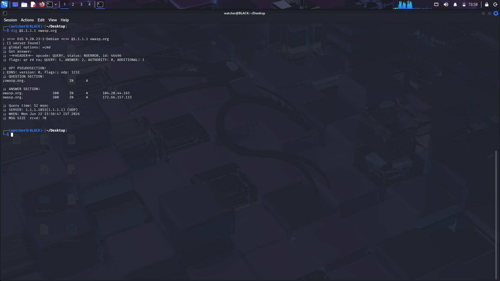
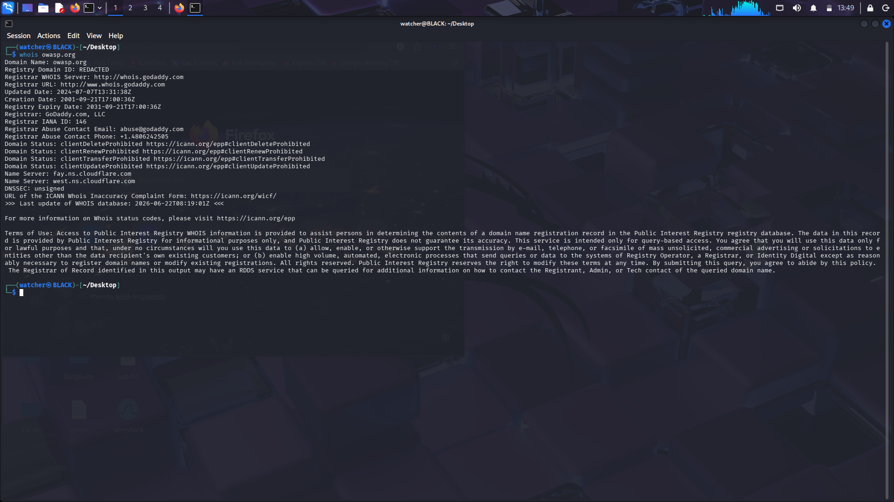
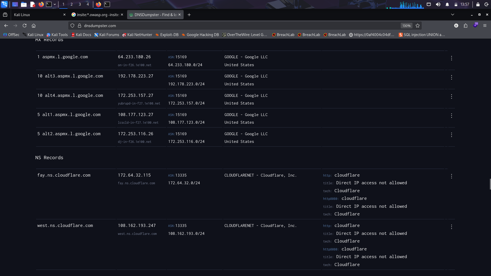
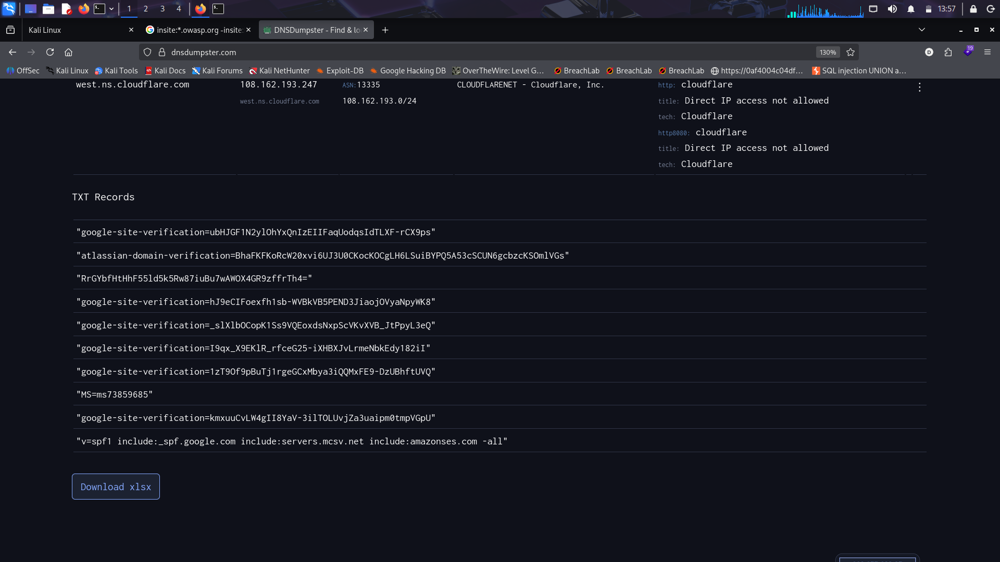
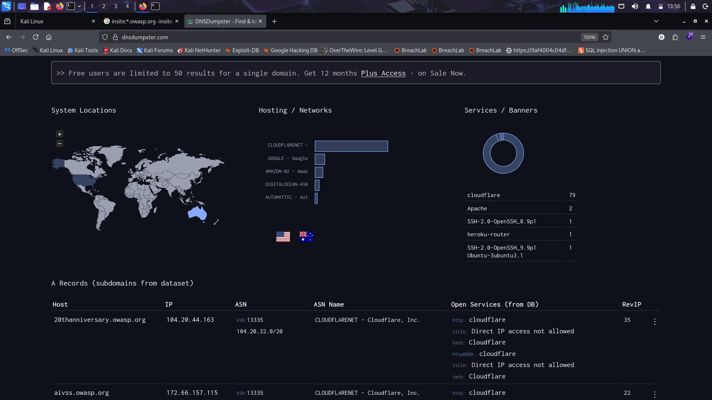
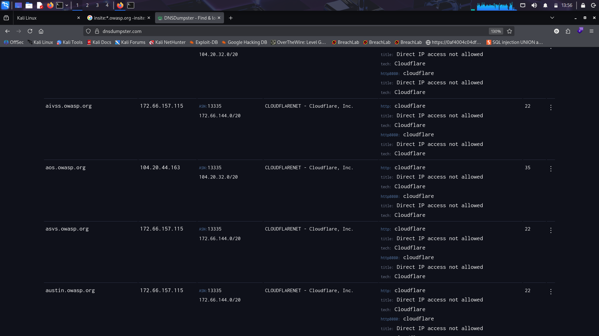
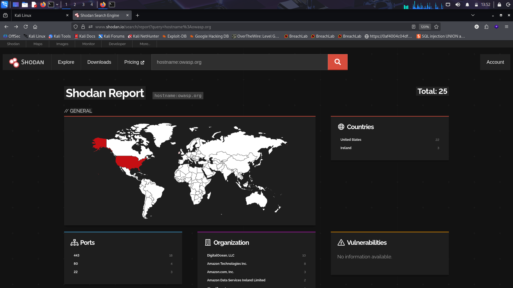
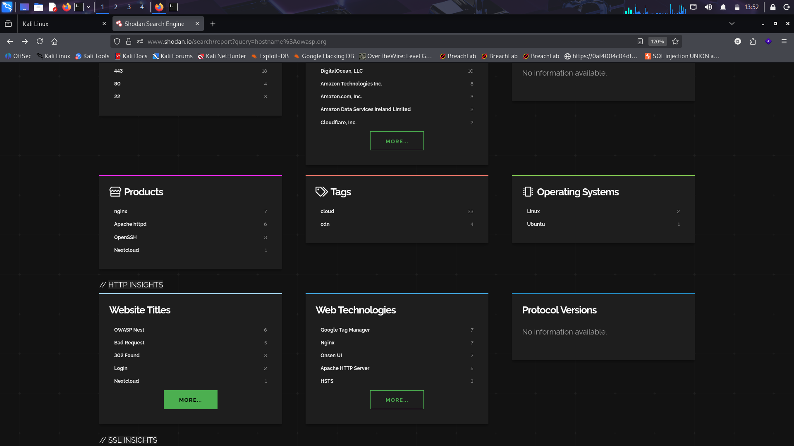
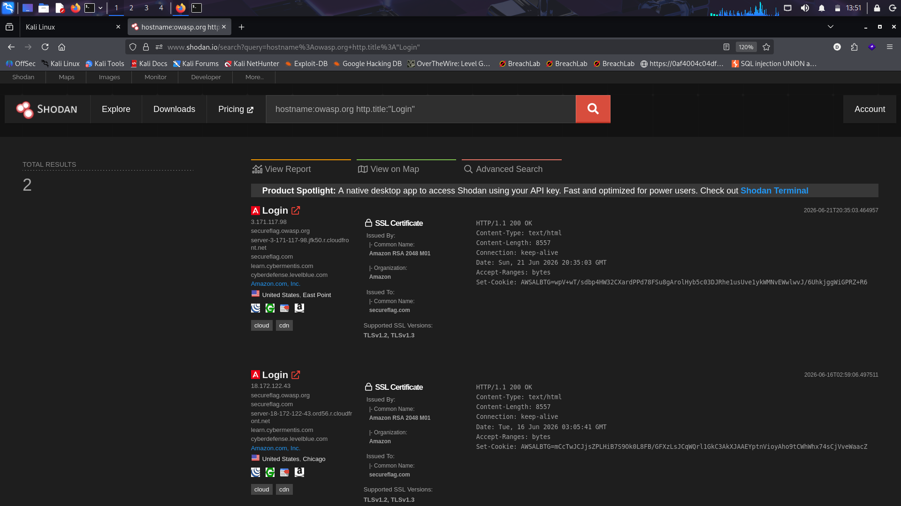

# OSINT Reconnaissance Report — owasp.org

| | |
|---|---|
| **Target Domain** | `owasp.org` |
| **Engagement Type** | Passive OSINT / Reconnaissance (no active exploitation) |
| **Date Conducted** | June 22, 2026 |
| **Tools Used** | `dig`, `whois`, Shodan, DNSDumpster |
| **Analyst** | Independent practice exercise |
| **Purpose** | Cybersecurity training / self-study reconnaissance walkthrough |

> **TLP:CLEAR** — Educational / training use only. No active scanning, exploitation, or unauthorized access was performed.

## Table of Contents

- [1. Executive Summary](#1-executive-summary)
- [2. Scope and Objectives](#2-scope-and-objectives)
- [3. Methodology](#3-methodology)
- [4. Tools Used](#4-tools-used)
- [5. Findings](#5-findings)
  - [5.1 DNS Resolution (dig)](#51-dns-resolution-dig)
  - [5.2 WHOIS Registration Data](#52-whois-registration-data)
  - [5.3 DNS Infrastructure Mapping (DNSDumpster)](#53-dns-infrastructure-mapping-dnsdumpster)
  - [5.4 Shodan Host Reconnaissance](#54-shodan-host-reconnaissance)
- [6. Consolidated Findings Summary](#6-consolidated-findings-summary)
- [7. Observations](#7-observations)
- [8. Conclusion](#8-conclusion)

---

## 1. Executive Summary

This report documents a passive open-source intelligence (OSINT) reconnaissance exercise performed against the public domain `owasp.org`, the website of the Open Worldwide Application Security Project (OWASP). The objective was to practice the information-gathering phase of the standard penetration-testing methodology using only publicly available, non-intrusive tools: `dig`, `whois`, Shodan, and DNSDumpster.

No active scanning, exploitation, or unauthorized access was attempted at any point. All data shown below is sourced from public DNS records, public domain registration records, and public internet-wide scan data already indexed by third-party services (Shodan, DNSDumpster). The exercise produced a footprint of OWASP's external infrastructure: hosting providers, DNS configuration, mail and SaaS integrations, and internet-facing services.

**Key takeaway:** `owasp.org`'s primary web presence sits behind Cloudflare, which masks origin IP addresses for most subdomains. A small number of assets — notably a SecureFlag-branded learning subdomain — are hosted directly on AWS infrastructure outside the Cloudflare proxy and were identified independently via Shodan.

## 2. Scope and Objectives

- Identify the IP addresses and authoritative name servers behind `owasp.org`.
- Retrieve domain registration (WHOIS) metadata.
- Enumerate DNS records (NS, MX, TXT, A) and discoverable subdomains.
- Identify internet-facing hosts, open ports, and service banners associated with `owasp.org` via Shodan.
- Locate any exposed login pages associated with the domain.

*Out of scope: active scanning (e.g., Nmap port scans against live hosts), vulnerability scanning, exploitation, social engineering, and any interaction with discovered login pages beyond observing their existence.*

## 3. Methodology

The exercise followed the standard passive-recon stage of the OSINT/penetration-testing lifecycle (Reconnaissance → Scanning → ...). Only the **Reconnaissance** stage was performed:

- **DNS resolution** — used `dig` against Cloudflare's public resolver (`1.1.1.1`) to resolve `owasp.org`'s A records.
- **Domain registration lookup** — used `whois` to pull registrar, registrant status, and name-server data.
- **DNS aggregation** — used DNSDumpster to enumerate NS/MX/TXT records, mapped subdomains, and a hosting/network overview.
- **Internet-wide scan data** — queried Shodan for all indexed hosts under `hostname:owasp.org`, then narrowed to hosts with a login page (`http.title:"Login"`).

All commands and queries were run from a Kali Linux environment configured for security training/practice.

## 4. Tools Used

| Tool | Type | Purpose |
|---|---|---|
| `dig` | DNS lookup utility | Resolve A records for `owasp.org` via a specified resolver |
| `whois` | Domain registration lookup | Retrieve registrar, dates, and name-server data |
| DNSDumpster | Web-based DNS recon aggregator | Enumerate NS/MX/TXT records and subdomains; map hosting providers |
| Shodan | Internet-wide scan search engine | Discover internet-facing hosts, open ports, banners, and login pages |

## 5. Findings

### 5.1 DNS Resolution (dig)

A direct query against Cloudflare's public resolver (`1.1.1.1`) for `owasp.org` returned a `NOERROR` response with two A records, each with a 300-second TTL:

| Record | Type | Value |
|---|---|---|
| owasp.org | A | 104.20.44.163 |
| owasp.org | A | 172.66.157.115 |

*Both addresses fall within Cloudflare-owned ranges, confirming the apex domain is proxied through Cloudflare rather than resolving directly to an origin server.*

<i>Figure 1 — dig @1.1.1.1 owasp.org resolving the apex A records</i>

### 5.2 WHOIS Registration Data

A `whois` lookup on `owasp.org` returned the following public registration details:

| Field | Value |
|---|---|
| Registrar | GoDaddy.com, LLC (IANA ID 146) |
| Creation Date | 2001-09-21 |
| Last Updated | 2024-07-07 |
| Expiry Date | 2031-09-21 |
| Name Servers | fay.ns.cloudflare.com, west.ns.cloudflare.com |
| DNSSEC | Unsigned |
| Domain Status | clientDeleteProhibited, clientRenewProhibited, clientTransferProhibited, clientUpdateProhibited |
| Abuse Contact | abuse@godaddy.com / +1.4806242505 |

*The domain has been registered for over two decades and carries all four standard EPP client-lock statuses, consistent with an actively maintained, non-expiring organizational domain. DNSSEC is not enabled.*

<i>Figure 2 — whois owasp.org registration record</i>

### 5.3 DNS Infrastructure Mapping (DNSDumpster)

DNSDumpster aggregates passive DNS data. Querying `owasp.org` surfaced MX records, NS records, TXT records, and a partial subdomain map (free-tier results are capped at 50 records per domain).

**MX Records (mail routing)**

| Host | Priority | IP | Provider |
|---|---|---|---|
| aspmx.l.google.com | 1 | 64.233.180.26 | Google LLC |
| alt1.aspmx.l.google.com | 5 | 108.177.123.27 | Google LLC |
| alt2.aspmx.l.google.com | 5 | 172.253.116.26 | Google LLC |
| alt3.aspmx.l.google.com | 10 | 192.178.223.27 | Google LLC |
| alt4.aspmx.l.google.com | 10 | 172.253.157.27 | Google LLC |

**NS Records (authoritative name servers)**

| Host | IP | Provider |
|---|---|---|
| fay.ns.cloudflare.com | 172.64.32.115 | Cloudflare, Inc. |
| west.ns.cloudflare.com | 108.162.193.247 | Cloudflare, Inc. |

*Both name servers report "Direct IP access not allowed" on HTTP/HTTP-8080 probes — expected behavior for IPs that only serve Cloudflare's edge network rather than original content.*

<i>Figure 3 — DNSDumpster: MX and NS records for owasp.org</i>

**TXT Records**

- Six `google-site-verification` tokens (Google Search Console / Workspace ownership proofs)
- One `atlassian-domain-verification` token (Atlassian/Jira/Confluence ownership proof)
- One `MS=ms73859685` token (Microsoft 365 domain verification)
- SPF record: `v=spf1 include:_spf.google.com include:servers.mcsv.net include:amazonses.com -all`

*The SPF record authorizes Google Workspace, Mailchimp/Mandrill (`servers.mcsv.net`), and Amazon SES as legitimate senders for the domain, while `-all` hard-fails any other source — a properly restrictive SPF configuration.*

<i>Figure 4 — DNSDumpster: public TXT records for owasp.org</i>

**Hosting / Network Overview and Subdomains**

DNSDumpster's network map shows `owasp.org`-related infrastructure spread across Cloudflare, Google, Amazon (AMAZON-02), DigitalOcean, and Automattic ASNs, with systems geolocated primarily in the United States and Australia. The aggregated service/banner chart was dominated by Cloudflare (79 hits), with a small number of directly-fingerprinted services: Apache (2), OpenSSH 8.9p1 (1), a Heroku router (1), and OpenSSH 9.9p1 on Ubuntu (1).

A sample of resolved subdomains (capped at 50 by the free tier) included:

| Subdomain | IP | Provider |
|---|---|---|
| 20thanniversary.owasp.org | 104.20.44.163 | Cloudflare |
| aivss.owasp.org | 172.66.157.115 | Cloudflare |
| aos.owasp.org | 104.20.44.163 | Cloudflare |
| asvs.owasp.org | 172.66.157.115 | Cloudflare |
| austin.owasp.org | 172.66.157.115 | Cloudflare |

<i>Figure 5 — DNSDumpster: hosting/network map and service banners</i>

<i>Figure 6 — DNSDumpster: sample of enumerated owasp.org subdomains</i>

### 5.4 Shodan Host Reconnaissance

A Shodan query for `hostname:owasp.org` returned 25 indexed hosts. Unlike the DNSDumpster view, Shodan indexes hosts by historical scan data and surfaced direct hosting relationships that sit outside Cloudflare's proxy.

| Attribute | Result |
|---|---|
| Total indexed hosts | 25 |
| Countries | United States (22), Ireland (3) |
| Top open ports | 443 (18), 80 (4), 22 (3) |
| Top organizations | DigitalOcean LLC (10), Amazon Technologies Inc (8), Amazon.com Inc (3), Amazon Data Services Ireland (2), Cloudflare Inc |
| Top products | nginx (7), Apache httpd (6), OpenSSH (3), Nextcloud (1) |
| Operating systems | Linux (2), Ubuntu (1) |
| Web technologies | Google Tag Manager (7), Nginx (7), Onsen UI (7), Apache HTTP Server (5), HSTS (3) |
| Website titles seen | OWASP Nest (6), Bad Request (5), 302 Found (3), Login (2), Nextcloud (1) |
| Known vulnerabilities flagged | None reported by Shodan |

<i>Figure 7 — Shodan report overview for hostname:owasp.org</i>

<i>Figure 8 — Shodan report: products, tags, OS, and web technologies</i>

**Exposed Login Pages**

Narrowing the Shodan query to `hostname:owasp.org http.title:"Login"` returned exactly 2 results, both pointing to the same logical asset rather than the main CMS:

| IP | Location | Hostnames | Notes |
|---|---|---|---|
| 3.171.117.98 | US — East Point | secureflag.owasp.org, securflag.com, learn.cybermentis.com, cyberdefense.levelblue.com | AWS-hosted; SSL cert CN=secureflag.com, issued by Amazon RSA 2048 M01; TLS 1.2/1.3 |
| 18.172.122.43 | US — Chicago | secureflag.owasp.org, securflag.com, learn.cybermentis.com, cyberdefense.levelblue.com | Same certificate/hostname set, second AWS edge node |

*Both hosts resolve to a SecureFlag-branded subdomain (a hands-on secure-coding training platform OWASP links to) and are hosted directly on Amazon Web Services — separate from the Cloudflare-fronted main site. This is the only directly-exposed login surface discovered under the `owasp.org` hostname during this exercise.*

<i>Figure 9 — Shodan: hostname:owasp.org http.title:"Login" results</i>

## 6. Consolidated Findings Summary

| Category | Key Finding |
|---|---|
| Apex DNS | `owasp.org` → 104.20.44.163 / 172.66.157.115 (Cloudflare-proxied) |
| Registrar | GoDaddy.com, LLC — registered 2001, expires 2031 |
| Name servers | Cloudflare (fay.ns / west.ns) |
| Mail provider | Google Workspace (MX), SPF authorizes Google + Mailchimp + Amazon SES |
| SaaS integrations (from TXT) | Google, Atlassian, Microsoft 365 |
| CDN / WAF | Cloudflare (fronts the large majority of subdomains) |
| Direct-hosting providers seen | AWS, DigitalOcean, Automattic (outside the Cloudflare proxy) |
| Open ports (Shodan) | 443, 80, 22 |
| Notable exposed asset | secureflag.owasp.org — AWS-hosted login page, outside Cloudflare |
| DNSSEC | Not enabled |
| Known CVEs flagged by Shodan | None |

## 7. Observations

- **Cloudflare materially reduces what passive recon alone can reveal** — most subdomains return only Cloudflare edge IPs, hiding true origin servers from tools like `dig` and DNSDumpster.
- **Shodan filled the gap Cloudflare created** — because Shodan indexes from its own internet-wide scans rather than DNS alone, it surfaced AWS-hosted assets (`secureflag.owasp.org`) that DNS-only tools did not directly expose as login-bearing hosts.
- **SPF is correctly configured** with a hard-fail (`-all`), limiting email-spoofing opportunities for the apex domain.
- **DNSSEC is not enabled** on `owasp.org`, which is a minor hardening gap (DNS responses are not cryptographically signed) but is common even among well-resourced organizations.
- **No vulnerabilities or outdated software banners** were flagged by Shodan for any indexed host at the time of this exercise.

## 8. Conclusion

This exercise successfully walked through the passive reconnaissance stage of OSINT methodology against a real-world, publicly accessible domain. Using only `dig`, `whois`, DNSDumpster, and Shodan — with no active scanning or exploitation — it was possible to map `owasp.org`'s registrar information, DNS/mail configuration, CDN usage, and a partial inventory of internet-facing assets, including one directly-exposed login surface hosted outside the main Cloudflare proxy.

All information in this report was already public at the time of collection (DNS records, WHOIS data, and indexed Shodan/DNSDumpster scan results). No systems were accessed, scanned beyond passive lookups, or otherwise interacted with.

---

TLP:CLEAR — Educational / Training Use

